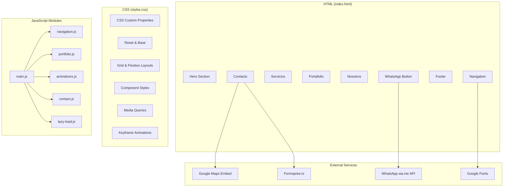

# Design Document: Constructora Jireh Web

## Overview

Sitio web single-page premium para Constructora Jireh SPA, construido con HTML5, CSS3 y JavaScript vanilla. El sitio transmite lujo y exclusividad mediante una estética oscura con acentos dorados, animaciones suaves y fotografía de alta calidad. Se despliega como sitio estático en GitHub Pages o Netlify, sin dependencias de frameworks ni build tools.

La arquitectura sigue un patrón de single-page con navegación por anclas (#), donde todas las secciones se renderizan en un solo archivo HTML. El CSS se organiza en un archivo principal con variables CSS (custom properties) para mantener consistencia visual. JavaScript se encarga de interacciones: menú móvil, scroll animations, lightbox del portafolio, validación del formulario y lazy loading de imágenes.

## Architecture

### Estructura del Proyecto

```
constructora-jireh-web/
├── index.html                 # Página principal (single-page)
├── css/
│   └── styles.css            # Estilos principales con CSS custom properties
├── js/
│   ├── main.js               # Inicialización y coordinación de módulos
│   ├── navigation.js         # Lógica del menú sticky y hamburguesa
│   ├── portfolio.js          # Masonry grid, filtros y lightbox
│   ├── animations.js         # Intersection Observer para scroll animations
│   ├── contact.js            # Validación del formulario
│   └── lazy-load.js          # Lazy loading de imágenes
├── img/
│   ├── hero/                 # Imágenes del hero section
│   ├── portfolio/            # Imágenes del portafolio (organizadas por categoría)
│   │   ├── casas/
│   │   ├── piscinas/
│   │   ├── terminaciones/
│   │   └── exteriores/
│   ├── about/                # Imágenes de la sección nosotros
│   └── icons/                # Iconos SVG para servicios
├── favicon.ico
├── sitemap.xml
├── robots.txt
├── README.md                 # Instrucciones para mantenimiento
└── CNAME                     # (Opcional) dominio personalizado
```

### Diagrama de Componentes



### Patrón de Carga

1. El navegador carga `index.html` con CSS inline crítico para above-the-fold
2. `styles.css` se carga de forma síncrona (render-blocking necesario para layout)
3. Google Fonts se cargan con `font-display: swap` para evitar FOIT
4. JavaScript se carga con `defer` para no bloquear el rendering
5. Imágenes debajo del fold usan `loading="lazy"` nativo + Intersection Observer como fallback
6. Hero image usa `fetchpriority="high"` para priorizar su carga

## Components and Interfaces

### 1. Hero Section

**Estructura HTML:**
```html
<section id="inicio" class="hero">
  <div class="hero__bg" style="background-image: url('img/hero/main.webp')"></div>
  <div class="hero__overlay"></div>
  <div class="hero__content">
    <h1 class="hero__title">Constructora Jireh</h1>
    <p class="hero__subtitle">Construimos hogares de alto estándar que superan expectativas</p>
    <a href="#contacto" class="hero__cta btn btn--gold">Solicitar Cotización</a>
  </div>
</section>
```

**Comportamiento:**
- Imagen de fondo 100vh con `background-attachment: fixed` para efecto parallax
- Overlay oscuro semi-transparente (rgba(0,0,0,0.55)) para contraste de texto
- Parallax implementado con `transform: translateY()` controlado por scroll event (throttled)
- Hero image en formato WebP con fallback JPEG

### 2. Navigation (navigation.js)

**Interfaz pública:**
```javascript
// navigation.js
export function initNavigation() { ... }
// Handles: sticky behavior, hamburger toggle, smooth scroll, active section highlight
```

**Comportamiento:**
- Estado inicial: fondo transparente sobre hero
- Al scrollear > 100px: transición a fondo sólido `rgba(18, 18, 18, 0.95)` con `backdrop-filter: blur(10px)`
- Menú hamburguesa (< 768px): icono animado de 3 líneas → X, panel slide-in desde la derecha
- Smooth scroll: `element.scrollIntoView({ behavior: 'smooth', block: 'start' })` con offset para el header sticky
- Active section tracking mediante Intersection Observer en cada `<section>`

### 3. Services Section

**Estructura HTML:**
```html
<section id="servicios" class="services">
  <div class="container">
    <h2 class="section-title">Nuestros Servicios<span class="section-title__accent"></span></h2>
    <div class="services__grid">
      <article class="service-card">
        <div class="service-card__icon"><!-- SVG inline --></div>
        <h3 class="service-card__title">Construcción de Casas</h3>
        <p class="service-card__desc">...</p>
      </article>
      <!-- 5 more cards -->
    </div>
  </div>
</section>
```

**Layout:** CSS Grid con `grid-template-columns: repeat(auto-fit, minmax(300px, 1fr))` — 3 cols desktop, 2 tablet, 1 mobile natural.

**Hover:** `transform: translateY(-8px)` + `box-shadow` expandido + border-color transition a dorado.

### 4. Portfolio (portfolio.js)

**Interfaz pública:**
```javascript
// portfolio.js
export function initPortfolio() { ... }

// Internal functions:
// - renderMasonryGrid(images, container)
// - filterByCategory(category)
// - openLightbox(index)
// - closeLightbox()
// - navigateLightbox(direction)
```

**Masonry Layout:**
- Implementado con CSS columns (`column-count: 3/2/1` según breakpoint) + `break-inside: avoid`
- Alternativa considerada: CSS Grid con `grid-auto-rows: masonry` (no soportado ampliamente aún)
- Cada imagen envuelta en `<figure>` con `<figcaption>` para overlay hover

**Lightbox:**
- Modal fullscreen con `position: fixed; inset: 0`
- Navegación: flechas laterales (click) + keyboard (← →) + swipe (touch events)
- Cierre: botón X + tecla Escape + click en backdrop
- Transición: fade-in 300ms con scale sutil
- Preload de imagen siguiente/anterior para navegación fluida

**Filtros:**
- Botones de categoría con estado activo (border-bottom dorado)
- Filtrado con CSS class toggle + transición opacity para efecto suave
- Categorías: "Todos", "Casas Completas", "Piscinas", "Terminaciones", "Exteriores"

**Lazy Loading (lazy-load.js):**
```javascript
// lazy-load.js
export function initLazyLoad() { ... }
// Uses native loading="lazy" + Intersection Observer fallback
// Threshold: 200px before viewport entry
// Placeholder: blur-up technique with tiny base64 preview
```

### 5. About Section

**Estructura:** Layout de 2 columnas (texto + imagen) con CSS Grid. En mobile se apila verticalmente.

**Counters:** Números animados usando `requestAnimationFrame` al entrar en viewport (Intersection Observer). Muestra: "+X Proyectos", "+Y Años de Experiencia".

### 6. Contact Section (contact.js)

**Interfaz pública:**
```javascript
// contact.js
export function initContactForm() { ... }

// Internal functions:
// - validateField(field)
// - validateForm()
// - submitForm(formData)
// - showSuccess()
// - showFieldError(field, message)
// - clearErrors()
```

**Validación cliente:**
| Campo    | Reglas                                          |
|----------|------------------------------------------------|
| Nombre   | Requerido, min 2 caracteres                    |
| Teléfono | Requerido, formato chileno (+56 9 XXXX XXXX)  |
| Email    | Requerido, formato email válido (regex)        |
| Mensaje  | Requerido, min 10 caracteres                   |

**Submit:** POST a Formspree.io endpoint (servicio gratuito para formularios estáticos, no requiere backend). Manejo de estados: loading spinner → success message / error message.

**Google Maps:** `<iframe>` embed con coordenadas de Bolivia 9, Alto Hospicio. Lazy-loaded con Intersection Observer para no impactar carga inicial.

### 7. WhatsApp Button

**Estructura HTML:**
```html
<a href="https://wa.me/569XXXXXXXX?text=Hola%2C%20me%20interesa%20cotizar%20un%20proyecto"
   class="whatsapp-btn"
   target="_blank"
   rel="noopener noreferrer"
   aria-label="Contactar por WhatsApp">
  <svg><!-- WhatsApp icon --></svg>
  <span class="whatsapp-btn__tooltip">Escríbenos por WhatsApp</span>
</a>
```

**Estilos:**
- `position: fixed; bottom: 24px; right: 24px; z-index: 1000`
- Tamaño: 60px × 60px (supera mínimo de 56px)
- Color de fondo: #25D366 (verde WhatsApp oficial)
- Animación pulse: `@keyframes pulse` con box-shadow expandiendo
- Tooltip aparece en hover con transición opacity

### 8. Animations (animations.js)

**Interfaz pública:**
```javascript
// animations.js
export function initAnimations() { ... }
// Uses Intersection Observer API
// Threshold: 0.15 (triggers when 15% of element is visible)
// rootMargin: "0px 0px -50px 0px"
```

**Tipos de animación:**
- `.fade-in`: opacity 0→1, translateY(30px→0)
- `.slide-left`: opacity 0→1, translateX(-50px→0)
- `.slide-right`: opacity 0→1, translateX(50px→0)
- `.scale-in`: opacity 0→1, scale(0.9→1)

**Performance:** Todas las animaciones usan `transform` y `opacity` exclusivamente (composite-only properties) para evitar layout thrashing. `will-change: transform, opacity` aplicado solo durante la animación.

## Data Models

### Configuración de Imágenes del Portafolio

```javascript
// Estructura de datos para el portafolio (definida en el HTML o JSON externo)
const portfolioData = [
  {
    src: "img/portfolio/casas/casa-01.webp",
    srcFallback: "img/portfolio/casas/casa-01.jpg",
    thumbnail: "img/portfolio/casas/casa-01-thumb.webp",
    alt: "Casa minimalista de doble altura en Alto Hospicio",
    category: "casas",       // "casas" | "piscinas" | "terminaciones" | "exteriores"
    title: "Residencia Altiplano"
  },
  // ... más proyectos
];
```

### Datos Estructurados SEO (JSON-LD)

```json
{
  "@context": "https://schema.org",
  "@type": "LocalBusiness",
  "@id": "https://constructorajireh.cl",
  "name": "Constructora Jireh SPA",
  "description": "Empresa de construcción de casas de alto estándar en Alto Hospicio, Chile",
  "url": "https://constructorajireh.cl",
  "telephone": "+569XXXXXXXX",
  "address": {
    "@type": "PostalAddress",
    "streetAddress": "Bolivia 9",
    "addressLocality": "Alto Hospicio",
    "addressRegion": "Tarapacá",
    "addressCountry": "CL"
  },
  "geo": {
    "@type": "GeoCoordinates",
    "latitude": -20.2133,
    "longitude": -70.1014
  },
  "founder": {
    "@type": "Person",
    "name": "Marcial Delgadillo Ruiz"
  },
  "taxID": "78.410.833-3",
  "serviceType": [
    "Construcción de Casas",
    "Obra Gruesa",
    "Terminaciones Finas",
    "Piscinas y Áreas Exteriores",
    "Remodelaciones",
    "Diseño Arquitectónico"
  ]
}
```

### CSS Custom Properties (Design Tokens)

```css
:root {
  /* Colors */
  --color-bg-primary: #0d0d0d;
  --color-bg-secondary: #1a1a1a;
  --color-bg-card: #222222;
  --color-text-primary: #f5f5f5;
  --color-text-secondary: #b3b3b3;
  --color-accent-gold: #c8a960;
  --color-accent-copper: #b87333;
  --color-accent-gold-light: #e8d5a3;
  --color-whatsapp: #25D366;
  --color-overlay: rgba(0, 0, 0, 0.55);
  --color-nav-bg: rgba(18, 18, 18, 0.95);

  /* Typography */
  --font-heading: 'Playfair Display', Georgia, serif;
  --font-body: 'Raleway', 'Segoe UI', sans-serif;
  --font-size-base: 1rem;
  --font-size-h1: clamp(2.5rem, 5vw, 4.5rem);
  --font-size-h2: clamp(1.8rem, 3vw, 2.8rem);
  --font-size-h3: clamp(1.2rem, 2vw, 1.5rem);

  /* Spacing */
  --section-padding: clamp(60px, 10vw, 120px);
  --container-max-width: 1200px;
  --container-padding: clamp(16px, 4vw, 40px);

  /* Transitions */
  --transition-fast: 200ms ease;
  --transition-medium: 300ms ease;
  --transition-slow: 500ms ease;

  /* Shadows */
  --shadow-card: 0 4px 20px rgba(0, 0, 0, 0.3);
  --shadow-card-hover: 0 8px 40px rgba(200, 169, 96, 0.15);

  /* Z-index scale */
  --z-nav: 100;
  --z-lightbox: 200;
  --z-whatsapp: 150;
}
```

### Meta Tags SEO

```html
<meta charset="UTF-8">
<meta name="viewport" content="width=device-width, initial-scale=1.0">
<meta name="description" content="Constructora Jireh SPA - Construcción de casas de alto estándar en Alto Hospicio, Chile. Casas minimalistas, piscinas, terminaciones premium. Cotiza tu proyecto.">
<meta name="keywords" content="constructora alto hospicio, construcción casas premium, constructora jireh, casas minimalistas chile, piscinas alto hospicio">
<meta name="author" content="Constructora Jireh SPA">
<meta property="og:title" content="Constructora Jireh - Casas de Alto Estándar">
<meta property="og:description" content="Construimos hogares premium que superan expectativas. Alto Hospicio, Chile.">
<meta property="og:image" content="img/hero/main.webp">
<meta property="og:type" content="website">
```

## Error Handling

### Formulario de Contacto
- **Validación en tiempo real:** Cada campo muestra error al perder foco (blur event) si no cumple reglas
- **Submit fallido (red):** Mensaje "Error al enviar. Por favor intente nuevamente o contáctenos por WhatsApp." con botón de retry
- **Timeout (5s):** Si Formspree no responde, mostrar error con alternativa WhatsApp
- **Sin JavaScript:** El formulario incluye `action` attribute a Formspree como fallback nativo

### Imágenes
- **Carga fallida:** `onerror` handler muestra placeholder SVG con icono de imagen rota
- **WebP no soportado:** `<picture>` element con `<source type="image/webp">` y `` fallback a JPEG
- **Lightbox sin imagen:** Si la imagen no carga en lightbox, mostrar mensaje y opción de cerrar

### Google Maps
- **Embed falla:** Mostrar div estático con dirección y enlace a Google Maps externo
- **Iframe blocked:** `onerror` + timeout (3s) reemplaza iframe con enlace directo

### JavaScript Deshabilitado
- El sitio es funcional sin JS: navegación por anclas funciona, imágenes se muestran (sin lazy load), formulario envía vía action attribute
- Clase `.no-js` en `<html>` removida por JS; CSS oculta elementos que requieren JS (lightbox, filtros animados)

### Navegadores No Soportados
- Intersection Observer: polyfill no incluido; fallback muestra todos los elementos visibles
- CSS Grid/Flexbox: funcionan en todos los navegadores modernos (IE11 no soportado)
- `backdrop-filter`: fallback a background sólido si no soportado

## Testing Strategy

### Unit Tests (Example-Based)

No se requiere framework de testing formal dado que es un sitio estático sin lógica de negocio compleja. La validación se realiza mediante:

1. **Validación HTML:** W3C Validator para asegurar markup válido y semántico
2. **Validación CSS:** W3C CSS Validator para detectar errores de sintaxis
3. **ESLint:** Configuración básica para validar JavaScript vanilla (no-unused-vars, no-undef, etc.)

### Integration/Manual Tests

| Test | Criterio de aceptación | Herramienta |
|------|----------------------|-------------|
| Responsive layout | Correcto en 320px, 768px, 1024px, 1440px, 2560px | Chrome DevTools |
| Navegación smooth scroll | Scroll suave a cada sección | Manual |
| Menú hamburguesa | Abre/cierra en mobile, links funcionan | Manual |
| Portfolio filtros | Filtra por categoría correctamente | Manual |
| Lightbox | Abre, navega (click + keyboard + swipe), cierra | Manual |
| Formulario validación | Errores en campos vacíos, éxito con datos correctos | Manual |
| WhatsApp button | Abre wa.me con mensaje correcto | Manual |
| Parallax hero | Efecto suave sin jank | Manual |
| Lazy loading | Imágenes cargan al scroll | Network tab |
| Cross-browser | Chrome, Firefox, Safari, Edge | BrowserStack/Manual |

### Performance Tests

| Métrica | Target | Herramienta |
|---------|--------|-------------|
| Lighthouse Performance | ≥ 90 | Chrome Lighthouse |
| Lighthouse Accessibility | ≥ 90 | Chrome Lighthouse |
| LCP (Largest Contentful Paint) | < 2.5s | WebPageTest |
| FCP (First Contentful Paint) | < 1.5s | Lighthouse |
| CLS (Cumulative Layout Shift) | < 0.1 | Lighthouse |
| Total page weight | < 3MB (initial) | Network tab |

### SEO Tests

| Test | Herramienta |
|------|-------------|
| Meta tags presentes y correctos | Manual / SEO checkers |
| JSON-LD válido | Google Rich Results Test |
| sitemap.xml válido | XML Sitemap Validator |
| Alt text en todas las imágenes | Lighthouse Accessibility |
| Headings hierarchy (h1 → h2 → h3) | Manual review |

### Accessibility Tests

| Test | Criterio |
|------|----------|
| Color contrast ratio | ≥ 4.5:1 para texto, ≥ 3:1 para elementos grandes |
| Keyboard navigation | Todos los interactivos accesibles vía Tab/Enter/Escape |
| Screen reader | ARIA labels en botones, lightbox, navegación |
| Focus visible | Outline visible en todos los elementos interactivos |
| Reduced motion | `prefers-reduced-motion` desactiva animaciones |

### Rationale: Why PBT Does Not Apply

Property-based testing no es aplicable a este proyecto porque:

1. **UI rendering and layout:** El sitio es primariamente visual — la corrección se valida visualmente, no con propiedades universales
2. **Side-effect operations:** Las interacciones principales (abrir WhatsApp, enviar formulario, navegar) son efectos secundarios sin retorno verificable
3. **No pure functions with wide input space:** La validación del formulario es simple (4 campos con reglas fijas), no justifica generación aleatoria masiva
4. **Static content:** La mayoría del sitio es contenido estático sin transformaciones de datos
5. **No parsers/serializers:** No hay parsing ni serialización de datos complejos

Se utilizan tests manuales, Lighthouse y validadores automáticos como estrategia apropiada para un sitio web estático.
